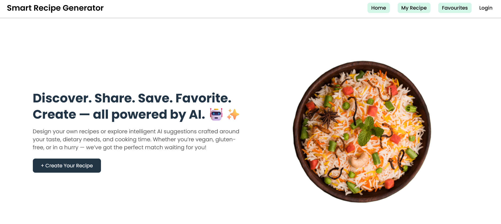

# 🍳 Smart Recipe Generator 🤖✨  
> An AI-powered recipe creation platform to **discover, create, and personalize mouth-watering dishes** — crafted with love, creativity, and a dash of AI inspiration. 😋  

---

## 🌟 Features Overview  

| Feature | Description |
|----------|--------------|
| 🧠 **AI Recipe Generation** | Generate complete recipes based on your available ingredients, cooking time, and dietary preferences. |
| ✍️ **Manual Recipe Creation** | Add your own recipes manually — with ingredients, difficulty, and cooking time. |
| ❤️ **Favorites & Rating System** | Save your favorite dishes and rate recipes to improve AI suggestions. |
| 🍽️ **Recipe Suggestions** | Personalized recommendations based on user favorites and ratings. |
| 🥗 **Filters & Customization** | Filter by difficulty, cuisine, cooking time, or dietary preference. |
| 📊 **Nutritional Info** | Each recipe displays estimated calories, protein, and more. |
| 📱 **Responsive UI** | Fully mobile-optimized with a clean and intuitive interface. |

---

## 🖥️ **Tech Stack**

| Layer | Technology |
|-------|-------------|
| 🎨 **Frontend** | React.js, TailwindCSS, React Router |
| ⚙️ **Backend** | Node.js, Express.js |
| 🧠 **AI Logic** | Gemini Api + OpenAI API (AI-based generation) |
| 🗄️ **Database** | MongoDB (Mongoose ORM) |
| 🔐 **Auth** | JWT Authentication |
 

---

## 📂 **Project Structure**
SmartRecipeGenerator/
│
├── frontend/ # React Frontend (UI)
├── backend/ # Express +  API backend
├── public/images/ # Uploaded recipe images
├── demo-images/ # Screenshots for README
├── .gitignore
├── package.json
└── README.md


---

## 🧩 **Required Features Implementation**


## 🏠 Home Page
A clean landing page that showcases AI-powered recipe discovery.




### 🥦 1. User Input
- Text input for ingredients
- Dropdowns for dietary preferences (Vegetarian, Vegan, etc.)
- Image Upload (used for AI analysis)

🖼️ *Example UI:*  


---

### 🍝 2. Recipe Generation
- AI automatically creates detailed recipes from given ingredients
- Includes step-by-step instructions & nutritional info

🖼️ *AI Generated Recipes:*  


---

### ⚙️ 3. Filters & Customization
- Filter recipes by difficulty, cooking time, or dietary restrictions
- Adjust servings dynamically

🖼️ *Filter Example:*  


---

### 🍱 4. Recipe Database
- Predefined recipes for multiple cuisines (Indian, Italian, Vegan, etc.)
- Each recipe includes:
  - Ingredients
  - Steps
  - Time
  - Dietary Preference
  - Nutritional Info

🖼️ *Recipe List UI:*  


---

### ⭐ 5. User Feedback & Suggestions
- Users can rate recipes from 1–5 ⭐  
- Favorites are stored locally  
- AI generates smart suggestions based on ratings and favorites  

🖼️ *User Feedback + Favourites:*  
  


---

### 🎨 6. UI/UX Design
- Modern, clean UI
- Fully mobile responsive
- Consistent theme with AI-friendly colors (green/blue tone)
  
🖼️ *Responsive Layout:*  


---

## 💾 **Installation Guide**

### 1️⃣ Clone Repository  
```bash
git clone https://github.com/nazilsheikh/SmartRecipeGenerator.git


